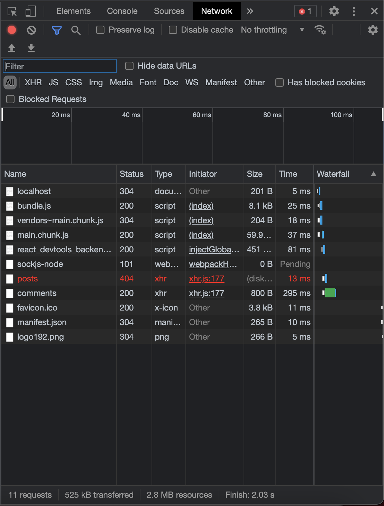

ReactJS challenge

This is a react app created from create-reacte-app for demo purposes.

You can clone this repository with the following command:

`$ git clone https://github.com/nnicolopez/react-js-challenge.git`

cd into the downloaded folder and run 

`$ npm i`

`$ npm start`

Make sure you have NodeJS installed.

The react app will load some posts and comments from https://jsonplaceholder.typicode.com/ and you only will be able to create some comments for different posts.

Since the API is a fake API the comments won't be stored in the server, instead, it will be in the memory used by redux store. So if yo refresh the page new comments will be lost.

https://jsonplaceholder.typicode.com/posts seems to be failing. To get the app working if the request fails there is a mocked file with the server response jus to be able to use the app.

